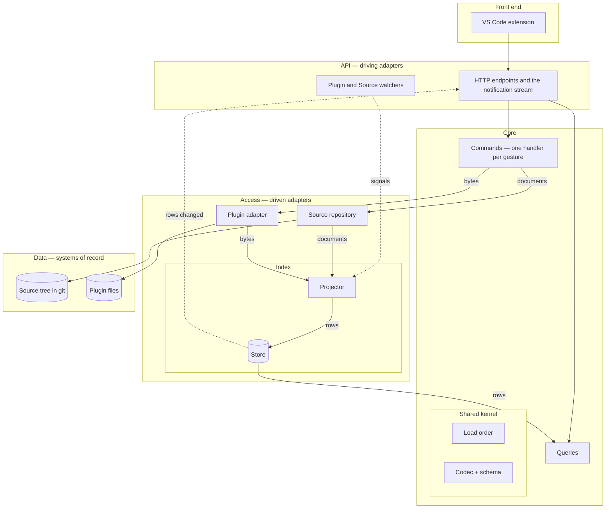

# Ports and adapters, with a write side, a read side, and one-way data flow

The editing backend grew as one service around one index. Its write path pushed rows into the
index, its queries re-read the source tree before answering, and its load order, index and
ingest were one type. Every module knew every other. This decision names the architecture the
code is converging on, so that each refactor in the migration is built to the same picture and
an implementing agent can answer structural questions from the document rather than the
maintainer. Vocabulary is the industry's: ports and adapters for the shape, command query
responsibility segregation for the two sides.

The full data-flow view, every arrow labelled with what moves and which way, is
[docs/architecture/target-architecture.drawio](../architecture/target-architecture.drawio),
read with [target-architecture.md](../architecture/target-architecture.md); the sketch below is
its module skeleton.

## Strategic invariants

1. **Two systems of record, one read model.** The plugin files and the source tree are the
   truth. The Index is a materialized view over both, rebuilt from them, never a source of
   truth, and never read by the write side.
2. **Five layers, each talking only to the one below.** Front end; API, the driving adapters;
   Core, the rules; Access, the driven adapters; Data. Access decides nothing. Core knows no
   path, no table and no byte format.
3. **Two hexagons in the core.** Commands are every mutation of a system of record, per record or
   per plugin, and the only writers of Source and Plugin. Queries are the only readers of the
   Index. The gesture is the interface: one handler per verb the user names.
4. **Data flows one way.** A command writes a system of record and knows nothing else. The
   Index learns of change only by watching the systems of record, and by a reconcile request.
   There is no validation on read and no push from the write side.
5. **Read-your-writes belongs to the read side.** When a projection lands, the Index publishes
   which rows changed and a projection sequence; the front end re-reads then. The same
   notification carries hand edits and other tools' writes, which have no other channel.
6. **Watchers are not trusted alone.** The projector validates the store by content hash at
   load, on reconcile, and on watcher overflow, and is idempotent by hash, so a duplicate signal
   is harmless.
7. **The write side's inputs are Source text, the envelope and the metadata tree.** It reads the
   load order for which plugin copy a record lives in, and the Source repository for whether a
   mod is tracked. Parse status comes from the codec at edit time. A document is never taken
   from the Index; a missing file is a refusal.
8. **A command returns applied-or-refusal, and what it did.** Every gesture answers with a
   success flag, the refusal that stopped it and the message naming the way out, its own payload
   beside them — the new FormKey, the diagnostics and masters, the landed keys. A refusal is a
   returned value, never an exception, and no command returns state the read side owns.
9. **The Source repository is the only repository.** It answers for documents by identity, for a
   whole plugin's documents, and for either of those at a named git ref, at the working tree or
   through the object store as the question demands. Layout, embedding, child paths, the write
   transaction and git live inside it, and turning an identity into a path is its work alone. It is a
   concrete module, not a port, because nothing varies across it.
10. **The Index is one deep module**, projector and store, with the interface refresh by keys,
    validate by hash, the projection sequence and its await, reconcile from the load order, and
    reads. The store is the module's own; nothing outside it names the store or its factory. The projector asks the load order which copy wins and the
    schema which fields are references and children; it decides nothing itself.
11. **The load order is state**, sent by Mod Management, held in the shared kernel with the
    participation and winner rules, read by both sides, persisted by the Index as rows like any
    other projection.
12. **The notification channel is a seam.** One publish interface in the backend, one subscribe
    interface in the extension, transport behind an adapter on each side, a test double as the
    second adapter.
13. **Architecture words live here. Domain words live in the glossary.**

## Derived tactical observations

These describe the present and may change without revisiting the invariants.

- The watchers are .NET file watchers in the Bridge assembly: the plugin watcher on mod folders,
  the Source watcher on each tracked mod's source folder and its git refs, HEAD, the refs
  directory and packed-refs. The Source watcher's quiet timer is shared across every watched
  plugin, not per plugin, so a write spanning several plugins settles as one batch; a second,
  non-restarting timer bounds the wait so a continuous stream still projects. The plugin watcher
  also signals Commands when a tracked plugin's bytes change outside, because absorb-or-keep is
  a user decision; that is the one upward arrow.
- The first transport adapter for notifications is a server-sent event stream on the HTTP API.
  The existing status polls migrate to it where they fit.
- The projection sequence is one monotonic number per process, advanced once per logical
  projection rather than once per transaction: a whole-plugin re-derivation is an ingest, a head
  reconcile and a winner sweep in four transactions, and a settled watcher batch is one of those
  per plugin named. The Index's store hands the projector a projection scope; every row
  transaction inside it commits on its own, and the single advance lands after the last of them,
  when the outermost scope closes. Scopes are per projection, not per store, so a reconcile and a
  settled batch running at once each land their own advance. A reader between a row commit and
  the advance sees the new rows at the old sequence — never the reverse — so awaiting the sequence
  is sound and reading before it is merely early. A notification carries the number its own
  projection landed on, published only once that advance is durable.
- Commands share an internal module for target resolution under the load order,
  external-change detection before a write, and rename on an EditorID change. It is an internal
  seam, tested through the handlers.
- The Plugin adapter is thin over Mutagen and says so.
- Tests cross the same seams callers do: the write API with a temporary source tree and a load
  order object and no Index; the Index through refresh and reads with a real DuckDB; the
  notification stream through an HTTP client; the load order through its rules.

## Relationship to other decisions

- [ADR-0002](0002-plugins-as-source-of-truth.md) and
  [ADR-0042](0042-plugin-is-the-source-of-truth-lossless-source.md) stand: this decision is the
  structure around the truth they define.
- [ADR-0044](0044-the-load-order-is-mirrored-not-loaded.md) stands on the load order as state
  and participation as derived. Its single fused type is now two modules, the load order and the
  Index's projector; that ADR points here for the split.
- [ADR-0032](0032-the-document-is-the-model.md) stands: the codec and schema are the shared
  kernel this decision names.

## Consequences

- The migration is four refactors in order, each its own PRD: children inline in their
  container's document so the Source repository has computable paths; one-way data flow with
  the watchers, the sequence and the notification stream, landed as expand then contract;
  the two-hexagon split with the load order as state and the write side blind to the Index; and
  command handlers around the pure document edit. Documents, glossary, namespaces and generated
  architecture views follow the code.
- Validate-on-read, the index's push verbs, the extension's post-write broadcast and the fused
  load-order-and-index type retired in that order.
- A tracked mod's source layout changes, so every tracked mod is re-Tracked once; that is the
  whole migration for users.
